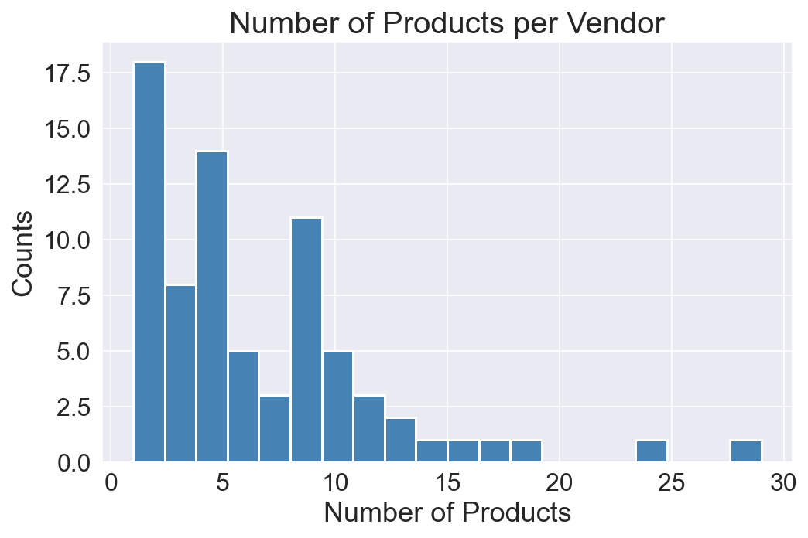
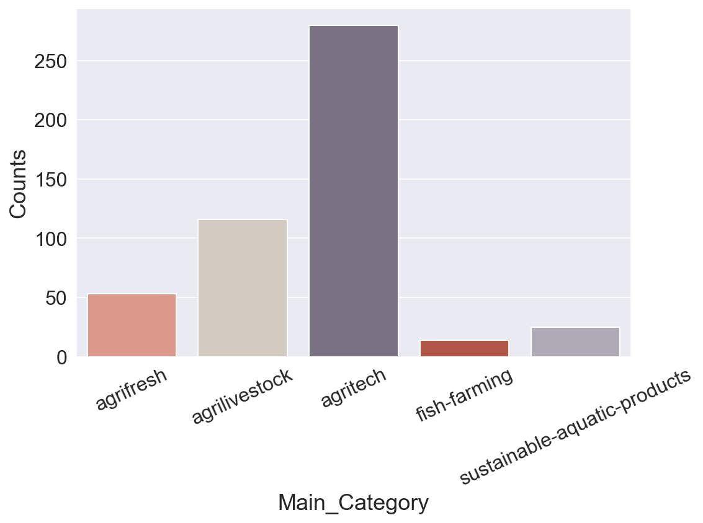
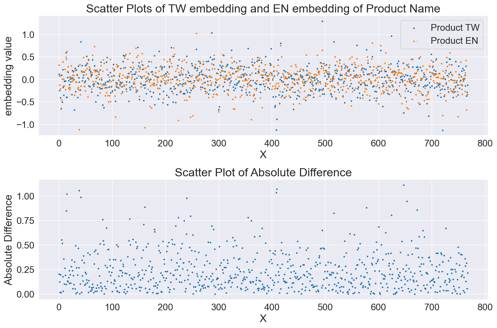

# Enhancing Product Discovery in Exhibition 📈

<!-- <font size=+3><center><b>Telco Churn Prediction with ML Insights 📈</b></center></font> -->

<span style="font-size: 12px;"><center><em>Photo by NVIDIA</em></center></span>
<span style="font-size: 20px;"><left><b>Table of Contents</b></left></span>

- [Introduction](#Introduction)
- [Objective](#Objective)
- [Libraries](#Libraries)
- [Default Setting](#Default-Setting)
- [Functions](#Functions)
- [A Quick Look at our Data](#A-Quick-Look-at-our-Data)
    - [Data Attributes](#Dataset-Attributes)
- [Exploratory Data Analysis](#Exploratory-Data-Analysis)
    - [Continuous Variables](#Continuous-Variables)
    - [Categorical Variables](#Categorical-Variables)
- [Data Preprocessing](#Data-Preprocessing)
    - [Encoding Categorical Features](#Encoding-Categorical-Features)
    - [Text Encoding](#Text-Encoding)
- [Recommendation Model Building](#Recommendation-Model-Building)
    - [Experiment and Parameter Tuning](#Experiment-and-Parameter-Tuning)
    - [Recommend Top K](#Recommend-Top-K)
- [Conclusions](#Conclusions)

# Introduciton

In the dynamic exhibition industry, attendees often face the challenge of efficiently discovering relevant products amidst a vast array of offerings. To address this issue, recommendation systems have gained significant attention for their ability to provide personalized suggestions based on user preferences. In this research, we aim to develop an item-based recommendation model tailored to the exhibition industry, leveraging the text descriptions of products available. By analyzing these features, our model will enable attendees to find products that closely align with their interests and recommend similar items, thereby enhancing the overall exhibition experience.

# Objective

In this case, the absence of explicit labels and user information poses a challenge for building effective recommendation models. This research aims to develop an item-based recommendation model using product features, leveraging unsupervised learning techniques to overcome the absence of labels and limited user information. By addressing this problem, the study aims to enhance product discovery and facilitate meaningful connections between attendees and exhibitors in the exhibition industry.

In this project, I would like to answer intriguing questions that I have discovered:

* What are the key product features that significantly influence the relevance and similarity of items within the exhibition industry? How can the item-based recommendation model effectively utilize these product features?
* What are the suitable similarity analysis techniques and algorithms that can measure item similarity based on the available product features?
* How can machine learning techniques be employed to train the item-based recommendation model using the exhibition industry's product feature dataset?
* What are the challenges and techniques involved in extracting relevant information from the text descriptions of products to enhance the recommendation model?
* How can the performance and accuracy of the recommendation model be evaluated and measured in the context of the exhibition industry, considering the absence of explicit labels?

# Libraries


```python
import warnings
warnings.simplefilter(action='ignore', category=FutureWarning)

# Write/Read Excel 
import openpyxl

import numpy as np
import pandas as pd
pd.set_option('precision', 3)

# Data Visualisation Libraries
import matplotlib.pyplot as plt
%config InlineBackend.figure_format = 'retina'

!pip install seaborn --upgrade
import seaborn as sns
sns.set_style('darkgrid')

from sklearn.preprocessing import OneHotEncoder, LabelEncoder, StandardScaler, MinMaxScaler

# Sentence BERT
from sentence_transformers import SentenceTransformer, util
print('✔️ Libraries Imported!')

# Save the dictionary
import pickle
```

    Requirement already satisfied: seaborn in c:\users\user\anaconda3\lib\site-packages (0.12.2)
    Requirement already satisfied: numpy!=1.24.0,>=1.17 in c:\users\user\anaconda3\lib\site-packages (from seaborn) (1.20.1)
    Requirement already satisfied: matplotlib!=3.6.1,>=3.1 in c:\users\user\anaconda3\lib\site-packages (from seaborn) (3.3.4)
    Requirement already satisfied: pandas>=0.25 in c:\users\user\anaconda3\lib\site-packages (from seaborn) (1.2.4)
    Requirement already satisfied: kiwisolver>=1.0.1 in c:\users\user\anaconda3\lib\site-packages (from matplotlib!=3.6.1,>=3.1->seaborn) (1.3.1)
    Requirement already satisfied: cycler>=0.10 in c:\users\user\anaconda3\lib\site-packages (from matplotlib!=3.6.1,>=3.1->seaborn) (0.10.0)
    Requirement already satisfied: pyparsing!=2.0.4,!=2.1.2,!=2.1.6,>=2.0.3 in c:\users\user\anaconda3\lib\site-packages (from matplotlib!=3.6.1,>=3.1->seaborn) (2.4.7)
    Requirement already satisfied: python-dateutil>=2.1 in c:\users\user\anaconda3\lib\site-packages (from matplotlib!=3.6.1,>=3.1->seaborn) (2.8.1)
    Requirement already satisfied: pillow>=6.2.0 in c:\users\user\anaconda3\lib\site-packages (from matplotlib!=3.6.1,>=3.1->seaborn) (8.2.0)
    Requirement already satisfied: six in c:\users\user\anaconda3\lib\site-packages (from cycler>=0.10->matplotlib!=3.6.1,>=3.1->seaborn) (1.15.0)
    Requirement already satisfied: pytz>=2017.3 in c:\users\user\anaconda3\lib\site-packages (from pandas>=0.25->seaborn) (2021.1)
    ✔️ Libraries Imported!
    

# Default Setting


```python
pd.options.display.max_rows = None
pd.options.display.max_columns = None

font_size = 18
plt.rcParams['axes.labelsize'] = font_size
plt.rcParams['axes.titlesize'] = font_size + 2
plt.rcParams['xtick.labelsize'] = font_size - 2
plt.rcParams['ytick.labelsize'] = font_size - 2
plt.rcParams['legend.fontsize'] = font_size - 2

# colors = ['#00A5E0', '#DD403A']
colors_cat = ['#E8907E', '#D5CABD', '#7A6F86', '#C34A36', '#B0A8B9', '#845EC2', '#8f9aaa', '#FFB86F', '#63BAAA', '#9D88B3', '#38c4e3']
# colors_comp = ['steelblue', 'seagreen', 'black', 'darkorange', 'purple', 'firebrick', 'slategrey']

random_state = 42
# scoring_metric = 'recall'
# comparison_dict, comparison_test_dict = {}, {}

print('✔️ Default Setting Done!')
```

    ✔️ Default Setting Done!
    

# Functions

## normalize_embedding()


```python
def normalize_embedding(embedding, norm=2):
    '''
    Normalize the input embedding vector.

    Args:
        embedding (numpy.ndarray): 
            The input embedding vector to be normalized.
        
        norm (int, default=2): 
            The order of the norm to be applied for normalization.
        
    Returns:
        numpy.ndarray:
            The normalized embedding vector.
    '''
    embedding = embedding / np.linalg.norm(embedding, ord=norm)
    return embedding
```

## recommend_top_k(product_id, k, threshold)


```python
def recommend_top_k(product_id: int, k: int, threshold: float) -> tuple:
    '''
    Recommend the top k similar products given a product ID.

    Args:
        product_id (int): 
            The ID of the product for which recommendations will be generated.

        k (int): 
            The number of top similar products to recommend.

        threshold (float): 
            The threshold value for similarity scores. 
            Only recommendations with scores equal to or greater than this threshold will be considered.

    Returns:
        tuple:
            A tuple containing two lists:
            - The recommended product IDs.
            - The corresponding similarity scores.
            - The row indices of the recommended products as a list.

    Example:
        rec_pd_ids, rec_scores, rec_row_indices = recommend_top_k(CU0004601801, 5)
    '''
    

    row_index = df[df['Product_id'] == product_id].index
    # the reason for using k+1 is because the given item will be recommended
    rec_k_dic = util.semantic_search(embedding[row_index], embedding, top_k=k+1)[0] 
    # drop the given item itself
    rec_k_dic = np.delete(rec_k_dic, 0)
    rec_row_idx = []
    rec_score_ls = []
    for item in rec_k_dic:
        score = round(item['score'], 3)
        if score >= threshold:
            rec_row_idx.append(item['corpus_id'])
            rec_score_ls.append(round(item['score'], 3)) 

    rec_pd_id_ls = np.array(df.loc[rec_row_idx, 'Product_id'])
    return (rec_pd_id_ls, rec_score_ls, rec_row_idx)
```

# A Quick Look at our Data

## Dataset Attributes

- **Product_id**: The unique ID of the product.
- **Product_Name**: The name or title of the product in Chinese.
- **Vendor_id**: The unique ID of the vendor.
- **Main_Category**: The main category or exhibition type of the product.
- **Sub_Category**: The sub-category or specific category of the product.
- **Description**: The text description of the product in Chinese.
- **Product_Name_en**: The name or title of the product in English.
- **Description_en**: The text description of the product in English.


```python
df = pd.read_excel('./Data/Product_20230702.xlsx', header=0, skiprows=[0,2,3,4])

print('✔️ Dataset Imported Successfully!\n')
print('It contains {} rows and {} columns.'.format(df.shape[0], df.shape[1]))
```

    ✔️ Dataset Imported Successfully!
    
    It contains 977 rows and 28 columns.
    


```python
df.head()
```


<div>
<style scoped>
    .dataframe tbody tr th:only-of-type {
        vertical-align: middle;
    }

    .dataframe tbody tr th {
        vertical-align: top;
    }

    .dataframe thead th {
        text-align: right;
    }
</style>
<table border="1" class="dataframe">
  <thead>
    <tr style="text-align: right;">
      <th></th>
      <th>語系*</th>
      <th>產品ID*</th>
      <th>產品名稱*</th>
      <th>自定關鍵字(逗點隔開)</th>
      <th>是否要貼標</th>
      <th>庫存狀況</th>
      <th>定價</th>
      <th>售價</th>
      <th>產品網址*</th>
      <th>廠商ID*</th>
      <th>廠商攤位號碼</th>
      <th>廠商名稱*</th>
      <th>國家簡寫*</th>
      <th>原廠名稱</th>
      <th>產品主類別*(展別)</th>
      <th>產品次類別*(類別)</th>
      <th>簡述 (展品特色)</th>
      <th>規格</th>
      <th>SEO Title</th>
      <th>SEO DES</th>
      <th>影片連結</th>
      <th>認證</th>
      <th>是否開啟*</th>
      <th>列表圖</th>
      <th>內頁圖片1</th>
      <th>Unnamed: 25</th>
      <th>Unnamed: 26</th>
      <th>Unnamed: 27</th>
    </tr>
  </thead>
  <tbody>
    <tr>
      <th>0</th>
      <td>tw</td>
      <td>CU0004601801</td>
      <td>PE 修補膠帶</td>
      <td>NaN</td>
      <td>1.0</td>
      <td>in_stock</td>
      <td>99.0</td>
      <td>99.0</td>
      <td>CU0004601801</td>
      <td>CU00046018</td>
      <td>NaN</td>
      <td>萬洲化學股份有限公司</td>
      <td>TW</td>
      <td>萬洲化學股份有限公司</td>
      <td>agritech</td>
      <td>Garden-Materials</td>
      <td>●全天候環保聚乙烯膠帶\n \n ●高粘合溶劑型丙烯酸粘合劑 \n \n ●適用於大範圍的戶...</td>
      <td>NaN</td>
      <td>NaN</td>
      <td>NaN</td>
      <td>NaN</td>
      <td>NaN</td>
      <td>1.0</td>
      <td>CU0004601801.jpg</td>
      <td>CU0004601801.jpg</td>
      <td>NaN</td>
      <td>NaN</td>
      <td>NaN</td>
    </tr>
    <tr>
      <th>1</th>
      <td>tw</td>
      <td>CU0004601802</td>
      <td>C+ 生物可分解膠帶</td>
      <td>NaN</td>
      <td>1.0</td>
      <td>in_stock</td>
      <td>99.0</td>
      <td>99.0</td>
      <td>CU0004601802</td>
      <td>CU00046018</td>
      <td>NaN</td>
      <td>萬洲化學股份有限公司</td>
      <td>TW</td>
      <td>萬洲化學股份有限公司</td>
      <td>agritech</td>
      <td>Garden-Materials</td>
      <td>● C+通用型包裝膠帶\n \n ●全世界第一個生物可分解OPP 包裝解決方案，可與一般PP...</td>
      <td>NaN</td>
      <td>NaN</td>
      <td>NaN</td>
      <td>NaN</td>
      <td>NaN</td>
      <td>1.0</td>
      <td>CU0004601802.jpg</td>
      <td>CU0004601802.jpg</td>
      <td>NaN</td>
      <td>NaN</td>
      <td>NaN</td>
    </tr>
    <tr>
      <th>2</th>
      <td>tw</td>
      <td>CU0004601803</td>
      <td>PVC 接梨膠帶</td>
      <td>NaN</td>
      <td>1.0</td>
      <td>in_stock</td>
      <td>99.0</td>
      <td>99.0</td>
      <td>CU0004601803</td>
      <td>CU00046018</td>
      <td>NaN</td>
      <td>萬洲化學股份有限公司</td>
      <td>TW</td>
      <td>萬洲化學股份有限公司</td>
      <td>agritech</td>
      <td>Garden-Materials</td>
      <td>●軟質亮面PVC 膠帶\n \n ●高剝離力\n \n ●適合用於梨子接枝 \n \n ●環...</td>
      <td>NaN</td>
      <td>NaN</td>
      <td>NaN</td>
      <td>NaN</td>
      <td>NaN</td>
      <td>1.0</td>
      <td>CU0004601803.jpg</td>
      <td>CU0004601803.jpg</td>
      <td>NaN</td>
      <td>NaN</td>
      <td>NaN</td>
    </tr>
    <tr>
      <th>3</th>
      <td>tw</td>
      <td>CU0004601804</td>
      <td>PVC 接梨膠帶</td>
      <td>NaN</td>
      <td>1.0</td>
      <td>in_stock</td>
      <td>99.0</td>
      <td>99.0</td>
      <td>CU0004601804</td>
      <td>CU00046018</td>
      <td>NaN</td>
      <td>萬洲化學股份有限公司</td>
      <td>TW</td>
      <td>萬洲化學股份有限公司</td>
      <td>agritech</td>
      <td>Garden-Materials</td>
      <td>軟質亮面PVC 膠帶、高剝離力、適合用於梨子接枝</td>
      <td>NaN</td>
      <td>NaN</td>
      <td>NaN</td>
      <td>NaN</td>
      <td>NaN</td>
      <td>1.0</td>
      <td>CU0004601804.jpg</td>
      <td>CU0004601804.jpg</td>
      <td>NaN</td>
      <td>NaN</td>
      <td>NaN</td>
    </tr>
    <tr>
      <th>4</th>
      <td>tw</td>
      <td>CU0004601805</td>
      <td>回收PET膠帶</td>
      <td>NaN</td>
      <td>1.0</td>
      <td>in_stock</td>
      <td>99.0</td>
      <td>99.0</td>
      <td>CU0004601805</td>
      <td>CU00046018</td>
      <td>NaN</td>
      <td>萬洲化學股份有限公司</td>
      <td>TW</td>
      <td>萬洲化學股份有限公司</td>
      <td>agritech</td>
      <td>Garden-Materials</td>
      <td>高黏著力、無溶劑、環境友善、高保持力、高機械強度</td>
      <td>NaN</td>
      <td>NaN</td>
      <td>NaN</td>
      <td>NaN</td>
      <td>NaN</td>
      <td>1.0</td>
      <td>CU0004601805.jpg</td>
      <td>CU0004601805.jpg</td>
      <td>NaN</td>
      <td>NaN</td>
      <td>NaN</td>
    </tr>
  </tbody>
</table>
</div>


Remove redundant variables


```python
df = df[['語系*', '產品ID*', '產品名稱*', '廠商ID*', '國家簡寫*', '產品主類別*(展別) ', '產品次類別*(類別)', '簡述 (展品特色)']]
```


```python
translation_dict = {
    '語系*': 'Language',
    '產品ID*': 'Product_id',
    '產品名稱*':'Product_Name',
    '廠商ID*': 'Vendor_id',
    '國家簡寫*': 'Country',
    '產品主類別*(展別) ': 'Main_Category',
    '產品次類別*(類別)': 'Sub_Category',
    '簡述 (展品特色)': 'Description'
}
df = df.rename(columns=translation_dict)
```

To combine descriptions in different languages, perform a self-join on the table.


```python
df_tw = df[df['Language']=='tw'].reset_index(drop = True, inplace = False)
df_en = df[df['Language']=='en'].reset_index(drop = True, inplace = False)
```


```python
df = pd.merge(df_tw, df_en, on='Product_id', how='outer')
```


```python
col_idx = np.concatenate((np.arange(1,8,1) , [df.columns.get_loc('Product_Name_y'),-1]))
df = df.iloc[:,col_idx]
```


```python
df.columns
```


    Index(['Product_id', 'Product_Name_x', 'Vendor_id_x', 'Country_x',
           'Main_Category_x', 'Sub_Category_x', 'Description_x', 'Product_Name_y',
           'Description_y'],
          dtype='object')


```python
col_name = ['Product_id', 'Product_Name', 'Vendor_id', 'Country', 'Main_Category',
            'Sub_Category', 'Description','Product_Name_en', 'Description_en']
df.columns = col_name
```

The `info()` method can give us valuable information such as the number of non-null values and the type of each feature:


```python
df.info()
df.head()
```

    <class 'pandas.core.frame.DataFrame'>
    Int64Index: 488 entries, 0 to 487
    Data columns (total 9 columns):
     #   Column           Non-Null Count  Dtype 
    ---  ------           --------------  ----- 
     0   Product_id       488 non-null    object
     1   Product_Name     488 non-null    object
     2   Vendor_id        488 non-null    object
     3   Country          488 non-null    object
     4   Main_Category    488 non-null    object
     5   Sub_Category     488 non-null    object
     6   Description      487 non-null    object
     7   Product_Name_en  488 non-null    object
     8   Description_en   487 non-null    object
    dtypes: object(9)
    memory usage: 38.1+ KB
    


<div>
<style scoped>
    .dataframe tbody tr th:only-of-type {
        vertical-align: middle;
    }

    .dataframe tbody tr th {
        vertical-align: top;
    }

    .dataframe thead th {
        text-align: right;
    }
</style>
<table border="1" class="dataframe">
  <thead>
    <tr style="text-align: right;">
      <th></th>
      <th>Product_id</th>
      <th>Product_Name</th>
      <th>Vendor_id</th>
      <th>Country</th>
      <th>Main_Category</th>
      <th>Sub_Category</th>
      <th>Description</th>
      <th>Product_Name_en</th>
      <th>Description_en</th>
    </tr>
  </thead>
  <tbody>
    <tr>
      <th>0</th>
      <td>CU0004601801</td>
      <td>PE 修補膠帶</td>
      <td>CU00046018</td>
      <td>TW</td>
      <td>agritech</td>
      <td>Garden-Materials</td>
      <td>●全天候環保聚乙烯膠帶\n \n ●高粘合溶劑型丙烯酸粘合劑 \n \n ●適用於大範圍的戶...</td>
      <td>PE repair tape</td>
      <td>●All-weather environmentally friendly polyethy...</td>
    </tr>
    <tr>
      <th>1</th>
      <td>CU0004601802</td>
      <td>C+ 生物可分解膠帶</td>
      <td>CU00046018</td>
      <td>TW</td>
      <td>agritech</td>
      <td>Garden-Materials</td>
      <td>● C+通用型包裝膠帶\n \n ●全世界第一個生物可分解OPP 包裝解決方案，可與一般PP...</td>
      <td>C biodegradable tape</td>
      <td>● C+ general purpose packing tape\n \n ●The wo...</td>
    </tr>
    <tr>
      <th>2</th>
      <td>CU0004601803</td>
      <td>PVC 接梨膠帶</td>
      <td>CU00046018</td>
      <td>TW</td>
      <td>agritech</td>
      <td>Garden-Materials</td>
      <td>●軟質亮面PVC 膠帶\n \n ●高剝離力\n \n ●適合用於梨子接枝 \n \n ●環...</td>
      <td>PVC pear tape</td>
      <td>●Soft and glossy finished PVC tape\n \n ●High ...</td>
    </tr>
    <tr>
      <th>3</th>
      <td>CU0004601804</td>
      <td>PVC 接梨膠帶</td>
      <td>CU00046018</td>
      <td>TW</td>
      <td>agritech</td>
      <td>Garden-Materials</td>
      <td>軟質亮面PVC 膠帶、高剝離力、適合用於梨子接枝</td>
      <td>PVC pear tape</td>
      <td>Soft and glossy finished PVC tape、High unwindi...</td>
    </tr>
    <tr>
      <th>4</th>
      <td>CU0004601805</td>
      <td>回收PET膠帶</td>
      <td>CU00046018</td>
      <td>TW</td>
      <td>agritech</td>
      <td>Garden-Materials</td>
      <td>高黏著力、無溶劑、環境友善、高保持力、高機械強度</td>
      <td>Recycled PET Tape</td>
      <td>Strong Adhesion、Solvent-Free、ECO-Friendly、Heav...</td>
    </tr>
  </tbody>
</table>
</div>


Modify the data type of category variables


```python
categorical = ['Country', 'Main_Category', 'Sub_Category']
df[categorical] = df[categorical].astype('category')
df.info()
```

    <class 'pandas.core.frame.DataFrame'>
    Int64Index: 488 entries, 0 to 487
    Data columns (total 9 columns):
     #   Column           Non-Null Count  Dtype   
    ---  ------           --------------  -----   
     0   Product_id       488 non-null    object  
     1   Product_Name     488 non-null    object  
     2   Vendor_id        488 non-null    object  
     3   Country          488 non-null    category
     4   Main_Category    488 non-null    category
     5   Sub_Category     488 non-null    category
     6   Description      487 non-null    object  
     7   Product_Name_en  488 non-null    object  
     8   Description_en   487 non-null    object  
    dtypes: category(3), object(6)
    memory usage: 29.7+ KB
    


```python
df['Main_Category'] = df['Main_Category'].replace({0:'N/A'})
df['Sub_Category'] = df['Sub_Category'].replace({0:'N/A'})
```


```python
df.isna().sum()
```


    Product_id         0
    Product_Name       0
    Vendor_id          0
    Country            0
    Main_Category      0
    Sub_Category       0
    Description        1
    Product_Name_en    0
    Description_en     1
    dtype: int64


```python
df['Description'] = df['Description'].fillna('')
df['Description_en'] = df['Description_en'].fillna('')
```

# Exploratory Data Analysis


```python
df['Vendor_id'].value_counts().hist(figsize=(8, 5),
                          bins=20,
                          color='steelblue',
                          linewidth=1.5);
plt.title('Number of Products per Vendor')
plt.xlabel('Number of Products')
plt.ylabel('Counts')
```


    Text(0, 0.5, 'Counts')


    

    


```python
df['Country'].value_counts()
```


    TW    487
    IT      1
    Name: Country, dtype: int64


```python
df.drop(columns = 'Country', inplace = True)
```

## Categorical variable


```python
df['Main_Category'].value_counts()
```


    agritech                        280
    agrilivestock                   116
    agrifresh                        53
    sustainable-aquatic-products     25
    fish-farming                     14
    Name: Main_Category, dtype: int64


```python
fig, ax = plt.subplots(figsize=(8, 6))
sns.countplot(x='Main_Category', data=df, palette=colors_cat, width=0.8)
plt.ylabel('Counts')
plt.xticks(rotation=25)
plt.tight_layout();
```


    

    


For certain subgroups, there are only a few products.


```python
df['Sub_Category'].value_counts()
```


    Agritech-Other                                           129
    Agrilivestock-Other                                       50
    Labour-Saving-Machinery-and-Equipment                     40
    Livestock-Feed-and-Additives                              37
    Garden-Materials                                          29
    Sustainable-Aquatic-Products-Other                        24
    Intelligent-Detection-System-and-Equipment                23
    Ventilation-Equipment                                     21
    Organic-Fertilizer                                        15
    Agrifresh-Other                                           13
    Agricultural-Processing-Machinery                         12
    Seedlings-and-Flower-Seed                                 11
    Plant-Disease-and-Pest-Control                            11
    AIoT-Intelligent-Cold-Chain-Logistic-Solution             10
    Refrigeration-and-Freezing-Equipment                      10
    Fish-Farming-Other                                         9
    Intelligent-Temperature-Control-Technology                 8
    AIoT-Equipment-and-System                                  8
    Intelligent-Environmental-Control-Devices-and-Systems      5
    Grow-Light                                                 4
    Agricultural-Automation-Equipment                          4
    Intelligent-Irrigation-System-and-Equipment                3
    Water-Quality-Improve                                      3
    Biotechnology-Applications                                 2
    Feed-and-Feed-Additive                                     1
    Feed-Processing-Equipment-and-Testing-Equipment            1
    Organic-Waste-Disposal-Technology-and-Equipment            1
    Dehydrated-and-Pickled-Aquatic-Products                    1
    Artificial-Fog-Equipment                                   1
    Aquaculture-Technology-and-Management                      1
    Thermal-Camera                                             1
    Name: Sub_Category, dtype: int64


## Text Description


```python
df['Description'].head()
```


    0    ●全天候環保聚乙烯膠帶\n \n ●高粘合溶劑型丙烯酸粘合劑 \n \n ●適用於大範圍的戶...
    1    ● C+通用型包裝膠帶\n \n ●全世界第一個生物可分解OPP 包裝解決方案，可與一般PP...
    2    ●軟質亮面PVC 膠帶\n \n ●高剝離力\n \n ●適合用於梨子接枝 \n \n ●環...
    3                             軟質亮面PVC 膠帶、高剝離力、適合用於梨子接枝
    4                             高黏著力、無溶劑、環境友善、高保持力、高機械強度
    Name: Description, dtype: object


```python
df['Description_en'].head()
```


    0    ●All-weather environmentally friendly polyethy...
    1    ● C+ general purpose packing tape\n \n ●The wo...
    2    ●Soft and glossy finished PVC tape\n \n ●High ...
    3    Soft and glossy finished PVC tape、High unwindi...
    4    Strong Adhesion、Solvent-Free、ECO-Friendly、Heav...
    Name: Description_en, dtype: object


# Data Preprocessing

We will create four embeddings:

* Main Category embedding 
* Subcategory embedding 
* Product Name embedding (tw)
* Product Name embedding (en)
* Product Description embedding (tw)
* Product Description embedding (en)

To generate accurate recommendation, we determine the weights of these embeddings based on their importance.


```python
arr = [1, 4, 1, 25, 1, 13]
alpha = arr/np.sum(arr)
```

## Categorical Features Encoding

Utilize one-hot encoding to encode the `Main_Category` and `Sub_Category` variables, enabling us to analyze the similarity between vectors in the further analysis


```python
main_encode = pd.get_dummies(df['Main_Category'], drop_first=False)*alpha[0]
sub_encode = pd.get_dummies(df['Sub_Category'], drop_first=False)*alpha[1]
category_encode = np.concatenate((main_encode, sub_encode), axis=1)
category_encode.shape
```


    (488, 36)


## Text Encoding

Utilize Sentence-BERT, which is based on Siamese BERT-Networks, to generate embeddings for both `Product_Name` and `Description`, as described in the paper ["Sentence-BERT: Sentence Embeddings using Siamese BERT-Networks"](https://arxiv.org/pdf/1908.10084.pdf) (Reimers & Gurevych, 2019).

Change English product name into lowercase to have a consistent structure


```python
df['Product_Name_en'] = df['Product_Name_en'].apply(lambda x: x.lower())
```


```python
model_en = SentenceTransformer('all-mpnet-base-v2')
model_tw = SentenceTransformer('paraphrase-distilroberta-base-v1')
product_em_tw_ = model_tw.encode(df['Product_Name'])
product_em_en_ = model_en.encode(df['Product_Name_en'])
des_em_tw_ = model_tw.encode(df['Description'])
des_em_en_ = model_en.encode(df['Description_en'])
```

Normalize the embeddings to mitigate the influence of magnitude on similarity


```python
product_em_tw = normalize_embedding(product_em_tw_) * alpha[2]
product_em_en = normalize_embedding(product_em_en_) * alpha[3]
des_em_tw = normalize_embedding(des_em_tw_) * alpha[4]
des_em_en = normalize_embedding(des_em_en_) * alpha[5]
```


```python
keywords_en_em = np.concatenate((product_em_en, des_em_en), axis = 1)
```


```python
# product_em = np.concatenate((product_em_tw, product_em_en), axis=1) * alpha[2]
# des_em = np.concatenate((des_em_tw, des_em_en), axis=1)  * alpha[3]
# text_em = np.concatenate((product_em, des_em), axis=1)
```


```python
text_em = np.concatenate((product_em_en, des_em_en, product_em_tw, des_em_tw), axis=1)
text_em.shape
```


    (488, 3072)


Combine category embedding and text embedding


```python
embedding = np.concatenate((category_encode, text_em), axis=1)
embedding.shape
```


    (488, 3108)


```python
df.loc[1:100,['Product_Name','Product_Name_en','Description_en']]
```


<div>
<style scoped>
    .dataframe tbody tr th:only-of-type {
        vertical-align: middle;
    }

    .dataframe tbody tr th {
        vertical-align: top;
    }

    .dataframe thead th {
        text-align: right;
    }
</style>
<table border="1" class="dataframe">
  <thead>
    <tr style="text-align: right;">
      <th></th>
      <th>Product_Name</th>
      <th>Product_Name_en</th>
      <th>Description_en</th>
    </tr>
  </thead>
  <tbody>
    <tr>
      <th>1</th>
      <td>C+ 生物可分解膠帶</td>
      <td>c biodegradable tape</td>
      <td>● C+ general purpose packing tape\n \n ●The wo...</td>
    </tr>
    <tr>
      <th>2</th>
      <td>PVC 接梨膠帶</td>
      <td>pvc pear tape</td>
      <td>●Soft and glossy finished PVC tape\n \n ●High ...</td>
    </tr>
    <tr>
      <th>3</th>
      <td>PVC 接梨膠帶</td>
      <td>pvc pear tape</td>
      <td>Soft and glossy finished PVC tape、High unwindi...</td>
    </tr>
    <tr>
      <th>4</th>
      <td>回收PET膠帶</td>
      <td>recycled pet tape</td>
      <td>Strong Adhesion、Solvent-Free、ECO-Friendly、Heav...</td>
    </tr>
    <tr>
      <th>5</th>
      <td>環保型牛皮紙膠帶</td>
      <td>eco-friendly kraft tape</td>
      <td>Writable、Solvent-Free、Good echanical\n \n Prop...</td>
    </tr>
    <tr>
      <th>6</th>
      <td>回收PET 水膠 膠帶</td>
      <td>recycled pet water adhesive tape</td>
      <td>●Good adhesion to paper fibers.\n \n ●Applicat...</td>
    </tr>
    <tr>
      <th>7</th>
      <td>水簾片</td>
      <td>evaporative cooling pad</td>
      <td>In animal husbandry, it can lower the ambient ...</td>
    </tr>
    <tr>
      <th>8</th>
      <td>紙護角</td>
      <td>edgeboard</td>
      <td>Edgeboard, also known as corner board or angle...</td>
    </tr>
    <tr>
      <th>9</th>
      <td>水簾片</td>
      <td>evaporative cooling pad</td>
      <td>There are several advantages to using evaporat...</td>
    </tr>
    <tr>
      <th>10</th>
      <td>水簾片</td>
      <td>evaporative cooling pad</td>
      <td>Evaporative cooling pad, also known as wet pad...</td>
    </tr>
    <tr>
      <th>11</th>
      <td>紙護角、護角紙、紙邊條</td>
      <td>edgeboard, edge protector</td>
      <td>To protect the edge of the goods during the tr...</td>
    </tr>
    <tr>
      <th>12</th>
      <td>奈米氣泡 增氧水質管理方案</td>
      <td>nanobubble and ufb systems for aeration and wa...</td>
      <td>Nanobubbles are tiny bubbles that are less tha...</td>
    </tr>
    <tr>
      <th>13</th>
      <td>物聯網設施環控解決方案</td>
      <td>iot automated solution for environmental control</td>
      <td>Aeon Matrix’s new Yardian Max multifunctional ...</td>
    </tr>
    <tr>
      <th>14</th>
      <td>光積值 精準澆灌解決方案</td>
      <td>precision irrigation system based on accumulat...</td>
      <td>Studies have shown that the amount of solar en...</td>
    </tr>
    <tr>
      <th>15</th>
      <td>智慧澆灌控制器</td>
      <td>smart sprinkler controller</td>
      <td>Designed and created by Aeon Matrix, the Smart...</td>
    </tr>
    <tr>
      <th>16</th>
      <td>霹靂穠研酒藏</td>
      <td>pili &amp; viachi spirits classics</td>
      <td>Agri-Dragon Biotech and Pili International Mul...</td>
    </tr>
    <tr>
      <th>17</th>
      <td>時氣純韻(糙米白酒)</td>
      <td>viachi spirit – longevity (brown rice)</td>
      <td>Made from Viachi brown rice, it is pleasantly ...</td>
    </tr>
    <tr>
      <th>18</th>
      <td>紅藜白酒</td>
      <td>red quinoa baijiu</td>
      <td>This Baijiu, fermented from red quinoa &amp; brown...</td>
    </tr>
    <tr>
      <th>19</th>
      <td>百花姬酒</td>
      <td>multi-flower spirit</td>
      <td>Not artificial flavoring but natural essence d...</td>
    </tr>
    <tr>
      <th>20</th>
      <td>丹參花葉酒</td>
      <td>danshen flowers &amp; leaves spirit</td>
      <td>Fermented from flowers and leaves of Viachi Da...</td>
    </tr>
    <tr>
      <th>21</th>
      <td>福氣永豐(葡萄酒)</td>
      <td>viachi spirit – abundance (grape)</td>
      <td>Made from healthy grapes cultivated using the ...</td>
    </tr>
    <tr>
      <th>22</th>
      <td>和氣元酒(丹參)</td>
      <td>viachi spirit – the dove (salvia)</td>
      <td>Introduction：\n \n Grown in the AgriDragon Bio...</td>
    </tr>
    <tr>
      <th>23</th>
      <td>天癒纖穀棒(原味/海苔)</td>
      <td>multigrain energy bars(vegan/seaweedflavor)</td>
      <td>Introduction：\n \n Specially selected Viachi b...</td>
    </tr>
    <tr>
      <th>24</th>
      <td>天癒丹參勁花茶</td>
      <td>viachi energizing herbal tea</td>
      <td>nIntroduction：\n \n Consisting of Salvia Milti...</td>
    </tr>
    <tr>
      <th>25</th>
      <td>天癒糙米堅果酥</td>
      <td>brown rice &amp; nut crispy treats</td>
      <td>Introduction： Specially selected Viachi brown ...</td>
    </tr>
    <tr>
      <th>26</th>
      <td>天癒糙米原漿(原味)</td>
      <td>brown rice milk (original)</td>
      <td>Introduction： Our Brown Rice Milk is composed ...</td>
    </tr>
    <tr>
      <th>27</th>
      <td>天癒糙米原漿(枸杞)</td>
      <td>brown rice milk (goji flavor)</td>
      <td>Introduction： Our Brown Rice Milk is composed ...</td>
    </tr>
    <tr>
      <th>28</th>
      <td>天癒五生米(糙米/胚芽米/白米)</td>
      <td>viachi rice (brown rice/germ rice/white rice)</td>
      <td>Cultivated by patented AgriGaia Biomimicry Far...</td>
    </tr>
    <tr>
      <th>29</th>
      <td>天癒五生元液</td>
      <td>micro whole food nutrition</td>
      <td>The nutrient-rich and energizing Micro Whole F...</td>
    </tr>
    <tr>
      <th>30</th>
      <td>天癒花草茶</td>
      <td>viachi herbal tea</td>
      <td>100% Pure &amp; Natural\n \n Relaxing, Calming, an...</td>
    </tr>
    <tr>
      <th>31</th>
      <td>龍殺球</td>
      <td>rotam-cs</td>
      <td>1. Rotam-CS can directly reduce the infectivit...</td>
    </tr>
    <tr>
      <th>32</th>
      <td>智慧蛋雞飼養系統-阿爾卑斯</td>
      <td>ai layer production system (alps)</td>
      <td>Artificial intelligent Layer Production System...</td>
    </tr>
    <tr>
      <th>33</th>
      <td>球霸</td>
      <td>altruism-cs plus</td>
      <td>1. A phytogenic formulation w/o drug residue\n...</td>
    </tr>
    <tr>
      <th>34</th>
      <td>青春露</td>
      <td>plant rejuvenator 101 (as pr101)</td>
      <td>1. To relieve or soothe the physiological diso...</td>
    </tr>
    <tr>
      <th>35</th>
      <td>果萌優 350</td>
      <td>go flower 350</td>
      <td>1. Encourage flower bud differentiation \n \n ...</td>
    </tr>
    <tr>
      <th>36</th>
      <td>花妍美 601</td>
      <td>go color 601</td>
      <td>1. Increase the No. of flower buds\n \n 2. Flo...</td>
    </tr>
    <tr>
      <th>37</th>
      <td>果妍美 380</td>
      <td>go beauty 380</td>
      <td>1. Enhance the fruit coloration\n \n 2. Enhanc...</td>
    </tr>
    <tr>
      <th>38</th>
      <td>全植能 100</td>
      <td>full energy 100</td>
      <td>1. Increase in production\n \n 2. Promote more...</td>
    </tr>
    <tr>
      <th>39</th>
      <td>有果甜 390</td>
      <td>go sweet 390</td>
      <td>1. Improve nutrient synthesis and transformati...</td>
    </tr>
    <tr>
      <th>40</th>
      <td>速益根 110</td>
      <td>root forte 110</td>
      <td>1. Encourage root growth\n \n 2. Increase the ...</td>
    </tr>
    <tr>
      <th>41</th>
      <td>蔬果強 370</td>
      <td>go growing 370</td>
      <td>1. Enhance nutrient absorption\n \n 2. Mesophy...</td>
    </tr>
    <tr>
      <th>42</th>
      <td>HOCL 次氯酸生成設備</td>
      <td>hocl generator</td>
      <td>The units electrolyze the salt water and, usin...</td>
    </tr>
    <tr>
      <th>43</th>
      <td>Envirolyte次氯酸殺菌電解水系統</td>
      <td>envirolyte hypochlorous acid sterilization ele...</td>
      <td>Envirolyte hypochlorous acid sterilization ele...</td>
    </tr>
    <tr>
      <th>44</th>
      <td>多功能磨刀機</td>
      <td>professional knife grinding machine</td>
      <td>Professional knife grinding machine</td>
    </tr>
    <tr>
      <th>45</th>
      <td>剁刀</td>
      <td>cleaver</td>
      <td>Cleaver</td>
    </tr>
    <tr>
      <th>46</th>
      <td>30cm 美式屠宰修割刀</td>
      <td>30cm cimiter</td>
      <td>30cm Cimiter</td>
    </tr>
    <tr>
      <th>47</th>
      <td>18cm 片魚刀</td>
      <td>18cm filletting knife</td>
      <td>18cm Filletting knife</td>
    </tr>
    <tr>
      <th>48</th>
      <td>18cm 剝皮刀</td>
      <td>18cm skinning knife</td>
      <td>18cm Skinning knife</td>
    </tr>
    <tr>
      <th>49</th>
      <td>15cm 剔骨刀</td>
      <td>15cm boniing knife</td>
      <td>15cm Boniing knife</td>
    </tr>
    <tr>
      <th>50</th>
      <td>15cm 彎剔骨刀</td>
      <td>15cm curved boning knife</td>
      <td>15cm Curved boning knife</td>
    </tr>
    <tr>
      <th>51</th>
      <td>24cm 剝筋刀</td>
      <td>24cm trimming knife</td>
      <td>24cm Trimming knife</td>
    </tr>
    <tr>
      <th>52</th>
      <td>14.5cm 剔骨刀</td>
      <td>14.5cm boning knife</td>
      <td>14.5cm Boning knife</td>
    </tr>
    <tr>
      <th>53</th>
      <td>農業紀錄APP</td>
      <td>agricultural record app</td>
      <td>Agricultural Record App</td>
    </tr>
    <tr>
      <th>54</th>
      <td>農業數據分析</td>
      <td>agricultural data analysis</td>
      <td>Agricultural Data Analysis</td>
    </tr>
    <tr>
      <th>55</th>
      <td>農地氣候的即時監測</td>
      <td>real-time monitoring of farmland climate</td>
      <td>Real-time monitoring of farmland climate</td>
    </tr>
    <tr>
      <th>56</th>
      <td>蜂巢- 解決方案</td>
      <td>beehive- solution</td>
      <td>Beehive- Solution</td>
    </tr>
    <tr>
      <th>57</th>
      <td>蜂巢數據科技</td>
      <td>beehive data technology</td>
      <td>Beehive data technology</td>
    </tr>
    <tr>
      <th>58</th>
      <td>物聯網服務-容易開發和管理</td>
      <td>iot service-easily develop and manage</td>
      <td>IoT service-Easily develop and manage</td>
    </tr>
    <tr>
      <th>59</th>
      <td>IoTConnect-多個SDK選項</td>
      <td>iotconnect-multiple sdk options</td>
      <td>IoTConnect-Multiple SDK options</td>
    </tr>
    <tr>
      <th>60</th>
      <td>IoTConnect--在雲端實現零编程</td>
      <td>iotconnect portal-zero programming at cloud</td>
      <td>IoTConnect portal-zero programming at cloud</td>
    </tr>
    <tr>
      <th>61</th>
      <td>安富利IotConnect-利用Azure物聯網的優勢</td>
      <td>avnet iotconnect-leveraging azure iot iot</td>
      <td>Avnet IotConnect-leveraging Azure IoT IoT</td>
    </tr>
    <tr>
      <th>62</th>
      <td>AIoT一站式服務</td>
      <td>aiot one-stop service</td>
      <td>AIoT one-stop service</td>
    </tr>
    <tr>
      <th>63</th>
      <td>蔬果語音分級機</td>
      <td>fruit grade weight voice sorter</td>
      <td>◆May select weighing or sorting mode.\n \n ◆Ma...</td>
    </tr>
    <tr>
      <th>64</th>
      <td>重量顯示控制器</td>
      <td>weighing indicator &amp; controller</td>
      <td>Model: BDI 9903B Weighing Indicator &amp; Controll...</td>
    </tr>
    <tr>
      <th>65</th>
      <td>重量顯示控制器</td>
      <td>weighing indicator &amp; controller</td>
      <td>Model: BDE 2007 Modbus Weighing Indicator &amp; Co...</td>
    </tr>
    <tr>
      <th>66</th>
      <td>重量顯示控制器</td>
      <td>weighing indicator &amp; controller</td>
      <td>Model: BDI 2001B Weighing Indicator &amp; Controll...</td>
    </tr>
    <tr>
      <th>67</th>
      <td>重量顯示檢測控制器</td>
      <td>check weighing indicator &amp; controller</td>
      <td>Model：BDI 9903 Check Weighing Indicator &amp; Cont...</td>
    </tr>
    <tr>
      <th>68</th>
      <td>重量顯示控制器</td>
      <td>weighing indicator &amp; controller</td>
      <td>Model: BDI 2002 Weighing Indicator &amp; Controlle...</td>
    </tr>
    <tr>
      <th>69</th>
      <td>重量顯示控制器</td>
      <td>weighing indicator &amp; controller</td>
      <td>Model: BDI 2006 Weighing Indicator &amp; Controlle...</td>
    </tr>
    <tr>
      <th>70</th>
      <td>單秤自動重量填充機</td>
      <td>sthp-601</td>
      <td>Description:\n \n \n \n ※Weighing ability up t...</td>
    </tr>
    <tr>
      <th>71</th>
      <td>重量檢測機</td>
      <td>check weigher</td>
      <td>Description:\n \n \n \n 1. Capacity: 2-500g (B...</td>
    </tr>
    <tr>
      <th>72</th>
      <td>BDI-2006 重量顯示器</td>
      <td>bdi-2006 weighing indicator &amp; controller</td>
      <td>Model Number：BDI-2006\n \n \n \n Description:\...</td>
    </tr>
    <tr>
      <th>73</th>
      <td>重量檢測選別機</td>
      <td>ad27-bw12l20 check weigher</td>
      <td>Model Number：CW99-BW12L30 (for small objects)\...</td>
    </tr>
    <tr>
      <th>74</th>
      <td>STHP-1000 太空包計量填充機</td>
      <td>sthp-1000 container bag filling machine</td>
      <td>Model Number：STHP-1000 (500kg - 1500kg)\n \n \...</td>
    </tr>
    <tr>
      <th>75</th>
      <td>STHP-800 自動計量填充機 (不鏽鋼型)</td>
      <td>sthp-800 filling machine</td>
      <td>Model Number：STHP-800 (20kg - 60kg) \n \n \n \...</td>
    </tr>
    <tr>
      <th>76</th>
      <td>計量填充機</td>
      <td>single weigher filling machine</td>
      <td>Description:\n \n \n \n ※Weighing ability up t...</td>
    </tr>
    <tr>
      <th>77</th>
      <td>塑環真®│《循環好盆友》</td>
      <td>plasti-circular pot</td>
      <td>◆ Made of waste from rice farmers in Taiwan an...</td>
    </tr>
    <tr>
      <th>78</th>
      <td>植循環盆</td>
      <td>bioticircular pot</td>
      <td>1. Recycle and Bioti-Circular : Made of recycl...</td>
    </tr>
    <tr>
      <th>79</th>
      <td>水源寶育樹盆</td>
      <td>bioticircular fortune planter (water-storing p...</td>
      <td>Low-tech, high-environmental protection\n \n T...</td>
    </tr>
    <tr>
      <th>80</th>
      <td>蜂蠟布(基本款/保鮮罩/超好蓋)</td>
      <td>beewax food wraps(basic/fresh cap/super nice w...</td>
      <td>Handmade with soft organic cotton, and natural...</td>
    </tr>
    <tr>
      <th>81</th>
      <td>樹根保護套</td>
      <td>three sleeve</td>
      <td>"• Single piece after circled is about dia. 4 ...</td>
    </tr>
    <tr>
      <th>82</th>
      <td>3英吋樹根透氣管</td>
      <td>breathable pipe  3-inch</td>
      <td>(1)  If the tree is sick, it is convenient to ...</td>
    </tr>
    <tr>
      <th>83</th>
      <td>2英吋樹根透氣管</td>
      <td>breathable pipe  2-inch</td>
      <td>• 2-inch pipes which is easy to operate, and c...</td>
    </tr>
    <tr>
      <th>84</th>
      <td>樹苗保護罩-B</td>
      <td>tree guard-b ( tree protector) for sapling</td>
      <td>1. Translucent polypropylene design provides s...</td>
    </tr>
    <tr>
      <th>85</th>
      <td>樹苗保護罩-A</td>
      <td>tree guard - a ( tree protector) for sapling</td>
      <td>1. Translucent polypropylene design provides s...</td>
    </tr>
    <tr>
      <th>86</th>
      <td>普力水質錠(農委會滅菌效力檢驗報告）</td>
      <td>puli water purification disinfect tablets</td>
      <td>disinfect</td>
    </tr>
    <tr>
      <th>87</th>
      <td>普力水質錠</td>
      <td>puli water purification disinfect tablets</td>
      <td>avoid H5N1 infect, water purification ,environ...</td>
    </tr>
    <tr>
      <th>88</th>
      <td>普力水產錠</td>
      <td>puli aquaculture disinfect tablets</td>
      <td>water purification, eliminate water germs, rem...</td>
    </tr>
    <tr>
      <th>89</th>
      <td>意嵐C12</td>
      <td>elan c12</td>
      <td>The active ingredient is α-monolaurin. The car...</td>
    </tr>
    <tr>
      <th>90</th>
      <td>意嵐乳化劑</td>
      <td>elan digest</td>
      <td>Add more efficient emulsifier ingredients (Lys...</td>
    </tr>
    <tr>
      <th>91</th>
      <td>蔘果葳</td>
      <td>sangrovit</td>
      <td>The alkaloids extracted from Macleaya cordata ...</td>
    </tr>
    <tr>
      <th>92</th>
      <td>腸穩健</td>
      <td>eubio-base</td>
      <td>The extract of Bidens pilosa can act on the in...</td>
    </tr>
    <tr>
      <th>93</th>
      <td>圓篩機</td>
      <td>vibro separator</td>
      <td>The machine occupies little space and easy to ...</td>
    </tr>
    <tr>
      <th>94</th>
      <td>粗碎機</td>
      <td>hammer mill</td>
      <td>The design of an enlarged pulverizing chamber ...</td>
    </tr>
    <tr>
      <th>95</th>
      <td>原料粗選機</td>
      <td>raw material rotary sifter</td>
      <td>Extensive use in accepting materials for wheat...</td>
    </tr>
    <tr>
      <th>96</th>
      <td>解碎機</td>
      <td>crumbler machine</td>
      <td>Specially adaptable for prawn rearing, handy a...</td>
    </tr>
    <tr>
      <th>97</th>
      <td>混合機</td>
      <td>mixer</td>
      <td>◆High efficiency of alternate arranged interio...</td>
    </tr>
    <tr>
      <th>98</th>
      <td>斗昇機</td>
      <td>bucket elevator equipment</td>
      <td>High efficiency, easily operated machine in ge...</td>
    </tr>
    <tr>
      <th>99</th>
      <td>懸浮式乾燥機</td>
      <td>floating dryer</td>
      <td>The high pressure steam from boiler gets throu...</td>
    </tr>
    <tr>
      <th>100</th>
      <td>霧化噴塗機</td>
      <td>spray device</td>
      <td>Uniform fogging effect : The original Japan no...</td>
    </tr>
  </tbody>
</table>
</div>


```python
eb = normalize_embedding(model_en.encode('food'))
eb = np.concatenate((eb, eb), axis = 0)
row_idx = []
score_ls = []
rec_k_dic = util.semantic_search(eb, keywords_en_em, top_k=10)[0]
for item in rec_k_dic:
    row_idx.append(item['corpus_id'])
    score_ls.append(round(item['score'],3))
df.loc[row_idx,['Product_id','Sub_Category','Product_Name']]
```


<div>
<style scoped>
    .dataframe tbody tr th:only-of-type {
        vertical-align: middle;
    }

    .dataframe tbody tr th {
        vertical-align: top;
    }

    .dataframe thead th {
        text-align: right;
    }
</style>
<table border="1" class="dataframe">
  <thead>
    <tr style="text-align: right;">
      <th></th>
      <th>Product_id</th>
      <th>Sub_Category</th>
      <th>Product_Name</th>
    </tr>
  </thead>
  <tbody>
    <tr>
      <th>390</th>
      <td>CU0008289202</td>
      <td>Agritech-Other</td>
      <td>有機蔬果</td>
    </tr>
    <tr>
      <th>469</th>
      <td>CU0103327702</td>
      <td>Agritech-Other</td>
      <td>生鮮蔬菜＿履歷牛番茄</td>
    </tr>
    <tr>
      <th>54</th>
      <td>CU0106103902</td>
      <td>AIoT-Intelligent-Cold-Chain-Logistic-Solution</td>
      <td>農業數據分析</td>
    </tr>
    <tr>
      <th>90</th>
      <td>CU0005376502</td>
      <td>Livestock-Feed-and-Additives</td>
      <td>意嵐乳化劑</td>
    </tr>
    <tr>
      <th>392</th>
      <td>CU0008289204</td>
      <td>Agritech-Other</td>
      <td>地中海料理蔬果</td>
    </tr>
    <tr>
      <th>299</th>
      <td>CU0001046724</td>
      <td>Labour-Saving-Machinery-and-Equipment</td>
      <td>人工智能送餐機器人</td>
    </tr>
    <tr>
      <th>139</th>
      <td>CU0106395604</td>
      <td>Organic-Fertilizer</td>
      <td>永綠牌活綠發果</td>
    </tr>
    <tr>
      <th>123</th>
      <td>CU0103365202</td>
      <td>Livestock-Feed-and-Additives</td>
      <td>速益生</td>
    </tr>
    <tr>
      <th>410</th>
      <td>CU0102854703</td>
      <td>Agritech-Other</td>
      <td>本媒合管道提供農產業者3項便利</td>
    </tr>
    <tr>
      <th>118</th>
      <td>CU0101721507</td>
      <td>Sustainable-Aquatic-Products-Other</td>
      <td>芭樂乾</td>
    </tr>
  </tbody>
</table>
</div>


```python
# Evaluate differnece by norm
# diff = product_em_en_[4] - eb
# print('Norm:',np.linalg.norm(diff))
```


```python
em_tw_plot = model_tw.encode(df['Product_Name'])
em_en_plot = model_tw.encode(df['Product_Name_en'])

# Create the figure and subplots
fig, (ax1, ax2) = plt.subplots(2, 1, figsize=(12, 8))
x = np.arange(0,len(em_tw_plot[0]),1)
diff = np.abs(em_tw_plot[0] - em_en_plot[0])

# Plot the scatter plots on the second subplot
ax1.scatter(x, em_tw_plot[0], s=3, label='Product TW')
ax1.scatter(x, em_en_plot[0], s=3, label='Product EN')
ax1.set_xlabel('X')
ax1.set_ylabel('embedding value')
ax1.set_title('Scatter Plots of TW embedding and EN embedding of Product Name')
ax1.legend()

# Plot the scatter plot on the first subplot
ax2.scatter(x, diff, s=3)
ax2.set_xlabel('X')
ax2.set_ylabel('Absolute Difference')
ax2.set_title('Scatter Plot of Absolute Difference')

# Adjust the spacing between subplots
plt.tight_layout()

# Show the plot
plt.show()
```


    

    


## Store embedding as a dictionary type in the file

Map the embedding to the corresponding product_id in a dictionary structure and store it


```python
# keys = df['Product_id']
# # embedding = torch.tensor(embedding)
# id_embedding_dict = dict(zip(keys, embedding))
# file_name = '.\embedding\item_embedding.pkl'
# with open(file_name, "wb") as file:
#     pickle.dump(id_embedding_dict, file)
```


```python
# product_em_en_dict = dict(zip(keys, product_em_en))
    
# file_name = '.\embedding\product_em_en.pkl'
# with open(file_name, "wb") as file:
#     # Serialize and write the dictionary to the file
#     pickle.dump(product_em_en_dict, file)
```


```python
# des_em_en_dict = dict(zip(keys, des_em_en))
    
# file_name = '.\embedding\des_em_en.pkl'
# with open(file_name, "wb") as file:
#     # Serialize and write the dictionary to the file
#     pickle.dump(des_em_en_dict, file)
```


```python
# keywords_en_em_dict = dict(zip(keys, keywords_en_em))
    
# file_name = '.\embedding\keywords_en_em.pkl'
# with open(file_name, "wb") as file:
#     # Serialize and write the dictionary to the file
#     pickle.dump(keywords_en_em_dict, file)
```

Load the dictionary of embedding


```python
# file_name = '.\embedding\item_embedding.pkl'
# with open(file_name, "rb") as file:
#     id_embedding_dict = pickle.load(file)
```

## Store preprocessed data as list([dict]) for use in Elasticsearch


```python
# df_dict = df[['Product_id', 'Product_Name', 'Product_Name_en', 'Description', 'Description_en']]
# # Create a dictionary mapping the old column names to the new column names
# column_mapping = {'Product_Name': 'Product_Name_tw',
#                   'Description': 'Description_tw'}
# # Convert the dataframe to dictionaries
# df_dict = [{column_name: df_dict.loc[index, column_name] for column_name in df_dict.columns} for index in range(df_dict.shape[0])]
# file_name = '.\Data\df_dict.pkl'
# with open(file_name, "wb") as file:
#     # Serialize and write the dictionary to the file
#     pickle.dump(df_dict, file)
```

# Recommendation Model Building

## Experiment and Parameter Tuning

Sample items in each category to evaluate


```python
# idx_list = []
# for colname in df['Sub_Category'].unique():
#     condition = df['Sub_Category'] == colname
#     idx = df[condition].sample(n=1).index[0]
#     idx_list.append(idx)
    
# sample_df = df.iloc[idx_list].drop(columns=['Product_id','Vendor_id','Country'])
```

Use all items to evaluate


```python
idx_list = np.arange(0, df.shape[0])
```

Recommend items by calculating the cosine similarity between the item embeddings. Output the results into a cell file and save them in an Excel file.


```python
# output_file = './Data/Rec-Agr-{}.xlsx'.format(arr)
# blank_row_color = 'FFFF00'  # Yellow color code

# # Load the existing workbook or create a new one
# try:
#     workbook = openpyxl.load_workbook(output_file)
# except FileNotFoundError:
#     workbook = openpyxl.Workbook()

# # Save the workbook
# workbook.save(output_file)

# # Get the default sheet name (usually "Sheet1")
# sheet_name = workbook.sheetnames[0]

# # Create a Pandas Excel writer using openpyxl engine and append mode
# writer = pd.ExcelWriter(output_file, engine='openpyxl', mode='a')

# # Assign the existing workbook to the writer
# writer.book = workbook

# # Select the default sheet
# writer.sheets = {sheet_name: workbook[sheet_name]}

# # Keep track of the row index for writing data
# current_row = writer.sheets[sheet_name].max_row + 1

# # Generate recommendations for each sample index
# for sample_idx in idx_list:
#     row_idx = []
#     score_ls = []
#     rec_k_dic = util.semantic_search(embedding[sample_idx], embedding, top_k=10)[0]
#     for item in rec_k_dic:
#         row_idx.append(item['corpus_id'])
#         score_ls.append(round(item['score'],3))  
# #     select_idx = np.insert(row_idx, 0, sample_idx) # Put the input item as a reference
#     output_df = df.iloc[row_idx]
#     output_df['Score'] = score_ls

#     # Set the cell color for the first row behind the blank row
#     sheet = writer.book[sheet_name]
#     for col in range(1, len(output_df.columns) + 10):
#         cell = sheet.cell(row=current_row + 1, column=col)
#         cell.fill = openpyxl.styles.PatternFill(fill_type='solid', fgColor=blank_row_color)

#     # Write the DataFrame to Excel
#     output_df.to_excel(writer, sheet_name=sheet_name, startrow=current_row, index=True, header=False)

#     # Update the current row index for the next set of recommendations
#     current_row += len(output_df) + 1  # Add 1 for the blank row

# # Save the Excel file
# writer.save()
# workbook.close()
# writer.close()
```

## Recommend Top K


```python
product_id = 'CU0004601801' # tape
# product_id = 'CU0009108101' # alcohol
# product_id = 'CU0004414408' # thermometer

k = 5
threshold = 0.75
row_index = df[df['Product_id'] == product_id].index
df.iloc[row_index]
```


<div>
<style scoped>
    .dataframe tbody tr th:only-of-type {
        vertical-align: middle;
    }

    .dataframe tbody tr th {
        vertical-align: top;
    }

    .dataframe thead th {
        text-align: right;
    }
</style>
<table border="1" class="dataframe">
  <thead>
    <tr style="text-align: right;">
      <th></th>
      <th>Product_id</th>
      <th>Product_Name</th>
      <th>Vendor_id</th>
      <th>Main_Category</th>
      <th>Sub_Category</th>
      <th>Description</th>
      <th>Product_Name_en</th>
      <th>Description_en</th>
    </tr>
  </thead>
  <tbody>
    <tr>
      <th>0</th>
      <td>CU0004601801</td>
      <td>PE 修補膠帶</td>
      <td>CU00046018</td>
      <td>agritech</td>
      <td>Garden-Materials</td>
      <td>●全天候環保聚乙烯膠帶\n \n ●高粘合溶劑型丙烯酸粘合劑 \n \n ●適用於大範圍的戶...</td>
      <td>pe repair tape</td>
      <td>●All-weather environmentally friendly polyethy...</td>
    </tr>
  </tbody>
</table>
</div>


```python
rec_pd_id_ls, rec_score_ls, rec_row_idx = recommend_top_k(product_id, k, 0.75)
for i in range(len(rec_pd_id_ls)):
    print('Product_id:', rec_pd_id_ls[i],'Score:', rec_score_ls[i])
df.iloc[rec_row_idx]
```

    Product_id: CU0004601803 Score: 0.866
    Product_id: CU0004601804 Score: 0.864
    Product_id: CU0004601805 Score: 0.83
    Product_id: CU0004601807 Score: 0.804
    Product_id: CU0004601802 Score: 0.789
    


<div>
<style scoped>
    .dataframe tbody tr th:only-of-type {
        vertical-align: middle;
    }

    .dataframe tbody tr th {
        vertical-align: top;
    }

    .dataframe thead th {
        text-align: right;
    }
</style>
<table border="1" class="dataframe">
  <thead>
    <tr style="text-align: right;">
      <th></th>
      <th>Product_id</th>
      <th>Product_Name</th>
      <th>Vendor_id</th>
      <th>Main_Category</th>
      <th>Sub_Category</th>
      <th>Description</th>
      <th>Product_Name_en</th>
      <th>Description_en</th>
    </tr>
  </thead>
  <tbody>
    <tr>
      <th>2</th>
      <td>CU0004601803</td>
      <td>PVC 接梨膠帶</td>
      <td>CU00046018</td>
      <td>agritech</td>
      <td>Garden-Materials</td>
      <td>●軟質亮面PVC 膠帶\n \n ●高剝離力\n \n ●適合用於梨子接枝 \n \n ●環...</td>
      <td>pvc pear tape</td>
      <td>●Soft and glossy finished PVC tape\n \n ●High ...</td>
    </tr>
    <tr>
      <th>3</th>
      <td>CU0004601804</td>
      <td>PVC 接梨膠帶</td>
      <td>CU00046018</td>
      <td>agritech</td>
      <td>Garden-Materials</td>
      <td>軟質亮面PVC 膠帶、高剝離力、適合用於梨子接枝</td>
      <td>pvc pear tape</td>
      <td>Soft and glossy finished PVC tape、High unwindi...</td>
    </tr>
    <tr>
      <th>4</th>
      <td>CU0004601805</td>
      <td>回收PET膠帶</td>
      <td>CU00046018</td>
      <td>agritech</td>
      <td>Garden-Materials</td>
      <td>高黏著力、無溶劑、環境友善、高保持力、高機械強度</td>
      <td>recycled pet tape</td>
      <td>Strong Adhesion、Solvent-Free、ECO-Friendly、Heav...</td>
    </tr>
    <tr>
      <th>6</th>
      <td>CU0004601807</td>
      <td>回收PET 水膠 膠帶</td>
      <td>CU00046018</td>
      <td>agritech</td>
      <td>Garden-Materials</td>
      <td>●對於紙纖維有良好的附著力。\n \n ●應用溫度: 0° C~ 50° C (32° F~...</td>
      <td>recycled pet water adhesive tape</td>
      <td>●Good adhesion to paper fibers.\n \n ●Applicat...</td>
    </tr>
    <tr>
      <th>1</th>
      <td>CU0004601802</td>
      <td>C+ 生物可分解膠帶</td>
      <td>CU00046018</td>
      <td>agritech</td>
      <td>Garden-Materials</td>
      <td>● C+通用型包裝膠帶\n \n ●全世界第一個生物可分解OPP 包裝解決方案，可與一般PP...</td>
      <td>c biodegradable tape</td>
      <td>● C+ general purpose packing tape\n \n ●The wo...</td>
    </tr>
  </tbody>
</table>
</div>


# Conclusions

Through data analysis, we gained clear insights into the distribution of products per vendor, identifying a skewed pattern. The utilization of bar plots effectively visualized the main categories and subcategories, providing valuable information for model-building.

Furthermore, our successful implementation of SBERT-based sentence embeddings allowed us to extract valuable text information, facilitating the development of an item-based recommendation system. By employing advanced unsupervised learning techniques, we delivered personalized item recommendations to customers in the industry. This approach resulted in enhanced attendee experiences, increased exhibitor revenue, and an elevated overall exhibition experience.
